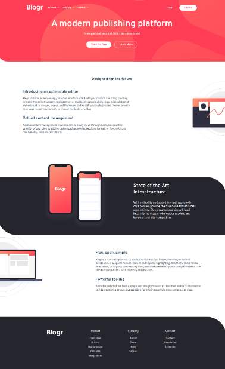

# Frontend Mentor - Blogr landing page solution

This is a solution to the
[Blogr landing page challenge on Frontend Mentor](https://www.frontendmentor.io/challenges/blogr-landing-page-EX2RLAApP).

## Table of contents

- [Overview](#overview)
  - [The challenge](#the-challenge)
  - [Screenshot](#screenshot)
  - [Links](#links)
- [My process](#my-process)
  - [Built with](#built-with)

## Overview

### The challenge

Users should be able to:

- ✅View the optimal layout for the site depending on their device's screen size
- ✅See hover states for all interactive elements on the page

### Screenshot

### Links

- Solution URL: https://blogr-landing-page-beta-pearl.vercel.app/
- Live Site URL: https://github.com/ahmad-kashkoush/blogr-landing-page

## My process

### Built with

- Semantic HTML5 markup
- CSS custom properties
- Flexbox
- Mobile-first workflow
